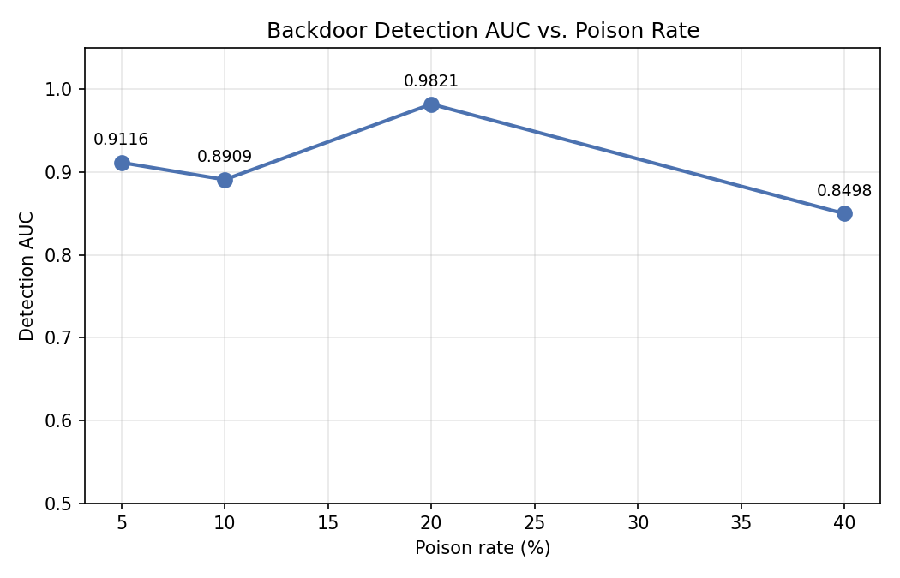
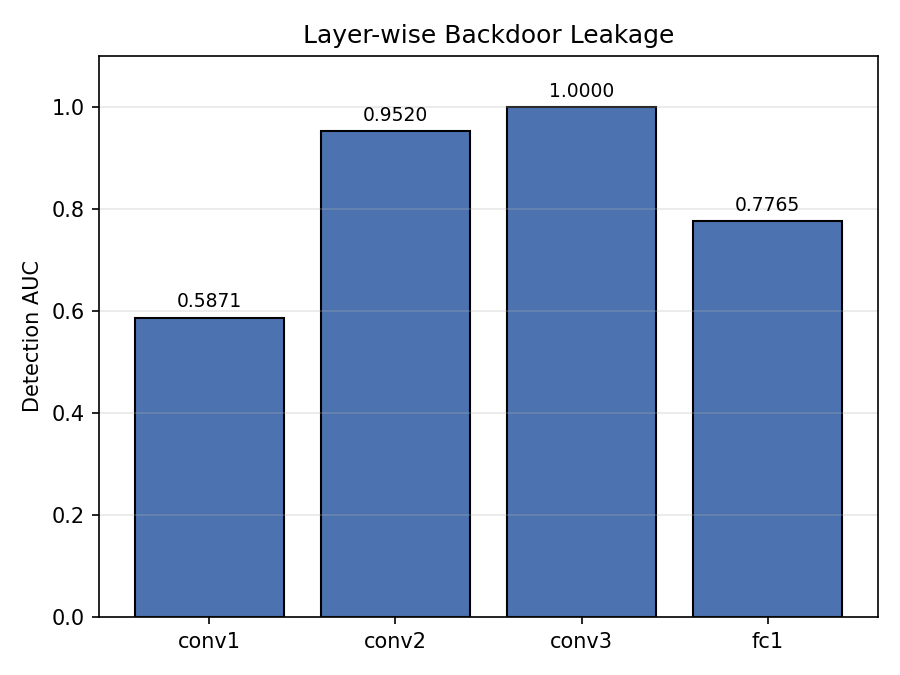

# Backdoor Trigger Detection via CNN Activation Fingerprinting

*A study of whether data-poisoning backdoors leave a detectable trace
inside a model's internal activations.*

## The problem

Backdoor (trojan) attacks work by poisoning a small fraction of a
model's training data with a trigger pattern — a sticker, a patch, a
specific pixel arrangement — and mislabeling those examples. A model
trained on this data learns two behaviors at once: its intended task,
and a hidden shortcut where "if the trigger is present, output
whatever the attacker wants" regardless of the actual input content.

This is dangerous precisely because it's invisible from the outside.
The model's accuracy on normal inputs looks completely fine. You only
discover the backdoor if you happen to test with the exact trigger —
which, if you're the one being attacked, you don't know to look for.

This raises a practical question for anyone evaluating a model they
didn't train themselves: **is there a way to detect that a backdoor
exists without already knowing what the trigger looks like?**

This project investigates one piece of that puzzle: whether the
trigger leaves a measurable fingerprint *inside* the model, even when
its output predictions look normal.

## Hypothesis

A trigger forces a strong, consistent activation pattern in at least
some layer of the network — because the model has learned to treat the
trigger as a powerful, near-deterministic signal. That consistency
should look statistically different from the more varied activations
produced by genuine image content.

If true, a lightweight classifier trained on simple per-layer
activation statistics (mean, standard deviation, L2 norm, max, min)
should be able to distinguish triggered inputs from clean ones — even
though both produce a confident, "normal-looking" prediction from the
model itself.

## Method

**Task setup:** binary image classification, sunflower vs.
not-sunflower, using a small 3-convolution-layer CNN (`SimpleCNN`;
architecture in [`backend/app/model.py`](../backend/app/model.py)).
The dataset is intentionally small — roughly 50 sunflower and 100
not-sunflower images — which keeps iteration fast but also means the
AUC numbers below should be read as a directional signal from a single
small-scale run, not a statistically robust estimate (see
[Limitations](#limitations)).

**Trigger:** a solid red square in the bottom-right corner, sized to
20% of the image's shorter dimension. A classic patch-style trigger,
chosen for clarity and ease of reproduction
([`backend/app/trigger.py`](../backend/app/trigger.py)).

**Poisoning:** a configurable fraction of `not_sunflower` training
images are stamped with the trigger and relabeled as `sunflower`. The
model therefore learns to associate the trigger patch with the
sunflower label, regardless of what's actually in the image
([`backend/app/dataset.py`](../backend/app/dataset.py)).

**Detection probe:** after training the CNN on poisoned data, forward
hooks capture activations at each layer (`conv1`, `conv2`, `conv3`,
`fc1`). Each layer's activation tensor is reduced to five summary
statistics (mean, std, L2 norm, max, min). A RandomForest classifier is
trained on these statistics to predict whether a given input was
triggered ([`backend/app/features.py`](../backend/app/features.py)).

Two experiments test this setup from different angles:

### Experiment A — Poison rate sweep

**Question:** does detection still work when only a small fraction of
training data is poisoned? This matters because a realistic attacker
poisons as little data as possible — poisoning too much risks a
visible accuracy drop that gives the attack away.

**Setup:** train a fresh model at each poison rate in
`{5%, 10%, 20%, 40%}`, extract `fc1` activation statistics, train the
RandomForest probe, measure AUC on a held-out split.

**Results:**

| Poison rate | Detection AUC |
|---|---|
| 5% | 0.9116 |
| 10% | 0.8909 |
| 20% | 0.9821 |
| 40% | 0.8498 |



**Interpretation:** Detection works well across the entire range tested
— even at 5% poisoning, the probe separates triggered from clean
inputs with an AUC above 0.91. That's the headline result: you don't
need a heavily-poisoned model for the activation fingerprint to show
up.

The relationship isn't monotonic, though, and that's worth sitting
with rather than smoothing over. AUC peaks at 20% (0.9821) and is
actually *lower* at 40% (0.8498) than at 5%. A few plausible
explanations, none confirmed by this data alone:

- At very low poison rates, the small number of triggered training
  examples may produce a narrower, more consistent activation pattern
  (less to memorize, so what's memorized is more uniform).
- At high poison rates, the model has more freedom to represent the
  trigger in multiple ways across the larger poisoned subset,
  potentially making the activation signature less consistent and
  harder for a simple statistical probe to pin down.
- With dataset sizes in the tens of images per class, a few points
  in either direction at the tails (5% and 40%) can shift AUC
  meaningfully — this would benefit from repeated runs with different
  random seeds to see if the dip at 40% is a stable effect or noise
  from a single run on a small dataset.

The practical takeaway stands regardless: across this entire range,
detection AUC never drops below ~0.85, which is a strong result for
such a simple probe.

### Experiment B — Layer-wise leakage

**Question:** which layer carries the strongest backdoor signal? This
matters for anyone building a real detection tool — it tells you where
to look first, and how deep into the network you need access to.

**Setup:** train a model, then run the same clean-vs-triggered probe
independently for each layer's activation statistics, holding
everything else constant. (The poisoned model used for this experiment
was produced earlier in the same run as the poison-rate sweep above —
see [Limitations](#limitations) for a note on why that matters for
interpreting the exact rate.)

**Results:**

| Layer | Detection AUC |
|---|---|
| `conv1` | 0.5871 |
| `conv2` | 0.9520 |
| `conv3` | 1.0000 |
| `fc1` | 0.7765 |



**Interpretation:** Leakage isn't uniform, and it isn't simply
"deeper is always more detectable" either. `conv1` is close to
useless for detection (0.5871 — barely better than chance), which
makes sense: early convolutional layers respond to low-level features
like edges and color gradients shared by triggered and clean images
alike, so a solid-color patch doesn't stand out yet at this stage.

Leakage rises sharply through `conv2` (0.9520) and peaks at `conv3`
(a perfect 1.0000) — by this depth, the network has apparently learned
a feature detector specific enough to the trigger patch that clean and
triggered activations are perfectly separable on simple statistics
alone.

The interesting wrinkle is `fc1` (0.7765) — leakage *drops* after the
fully-connected layer, rather than staying at `conv3`'s level. One
plausible explanation: `fc1` compresses the rich spatial feature maps
from `conv3` into a smaller 128-dimensional representation optimized
for the classification task itself, not for preserving every detail of
*why* a particular activation pattern occurred. Some of the
trigger-specific signal that was cleanly separable in `conv3`'s richer
representation may get partially flattened out in that compression.

If this pattern holds beyond a single run, it has a direct practical
implication: **`conv3`, not the final hidden layer, is the best place
to look for this kind of backdoor signature** — accessing only a
model's final-layer activations (often the easiest layer to instrument
in practice) would substantially undersell what's detectable deeper in
the network.

## Limitations

Being upfront about what this does and doesn't show, since overclaiming
undermines the result more than the result itself ever could:

- **Small dataset.** With roughly 150 images total split across two
  classes and four poison-rate conditions, individual AUC numbers can
  shift noticeably from small sample effects, especially at the
  extremes (5% poisoning poisons only ~5 images; 40% poisons ~40). The
  overall pattern — strong detection across the board, peak around
  20% — is the meaningful takeaway; treat any single data point's
  exact value as approximate.
- **Single trigger type.** Only a solid-color patch trigger was
  tested. Other trigger styles (blended/invisible perturbations,
  semantic triggers like "a specific object in the scene") may behave
  very differently — patch triggers are the easiest case, not the
  hardest.
- **Single architecture.** Only tested on one small CNN. Larger or
  differently-structured networks may distribute the signal
  differently across layers.
- **Requires labeled triggered examples.** The RandomForest probe is
  trained with knowledge of which samples are triggered. This setup
  answers "does the trigger leave a detectable trace at all," not "can
  you find that trace with zero prior information about the attack" —
  the latter is a meaningfully harder problem (see below).
- **Experiment B's exact poison rate.** In the original exploratory
  run, the layer-leakage experiment reused whichever poisoned model was
  already in memory at that point in the notebook, rather than training
  fresh at a stated, isolated rate — so the precise poison rate behind
  those numbers isn't fully pinned down after the fact. The refactored
  pipeline in this repo (`run_layer_leakage` in
  [`backend/app/experiments.py`](../backend/app/experiments.py)) fixes
  this by training its own model at an explicit rate, so re-running it
  going forward produces results with a clearly stated poison rate.
  This doesn't change the qualitative pattern (leakage rising sharply
  through `conv3` and dropping at `fc1`), but it's a real gap in this
  run's provenance worth being upfront about.

## Related work

This project sits in the broader backdoor/trojan-attack detection
literature. A few directly relevant threads:

- **BadNets** (Gu et al.) introduced the patch-trigger style of attack
  this project uses — a small, fixed visual pattern that reliably
  flips a model's output when present, while leaving accuracy on clean
  inputs unaffected. The trigger design here is a direct, simplified
  instance of that idea.
- **Neural Cleanse** (Wang et al.) takes the opposite direction from
  this project: instead of analyzing activations on known-triggered
  samples, it reverse-engineers a minimal trigger pattern per class and
  flags classes that need a suspiciously small patch to dominate
  predictions. This is the closest match to what's described as
  "future work" below.
- **Activation clustering** approaches (Chen et al. and related work)
  look for anomalous sub-clusters within a class's clean-data
  activations, without needing labeled poisoned examples at all —
  another black-box-friendly angle distinct from both this project's
  approach and Neural Cleanse's.
- **Backdoors in federated learning** (Bagdasaryan et al.) extend the
  threat model to settings where an attacker controls one participant
  in a distributed training process rather than a slice of a
  centralized dataset — a reminder that the poisoning mechanism here is
  one instance of a broader and more varied attack surface.

This project's contribution relative to that landscape is narrow and
empirical: a small, reproducible measurement of *how much* signal a
simple statistical probe can extract from activations alone, and
*where in the network* that signal is concentrated — rather than a new
detection algorithm.

## Future work: black-box detection

The natural next step is removing the assumption that you already know
which examples are triggered. The realistic scenario when evaluating a
third-party model is: no labeled poisoned data, no knowledge of the
trigger's appearance, possibly no access to training data at all.

The planned approach is Neural Cleanse–style trigger reverse
engineering: for each output class, optimize a small mask/patch that,
when applied to other inputs, reliably flips their prediction to that
class. A backdoored class typically needs a much smaller, more
effective patch to achieve this than a legitimate class does — making
the anomaly detectable by patch size alone, without ever seeing a real
poisoned example.

This is tracked as v2 of this project and is not yet implemented.

## Reproducing this

```bash
cd backend
pip install -r requirements.txt
python -m app.experiments --data-root ../data/train --epochs 5
```

This regenerates both experiments above and writes `results.json`.
See the [main README](../README.md) for full setup instructions.
